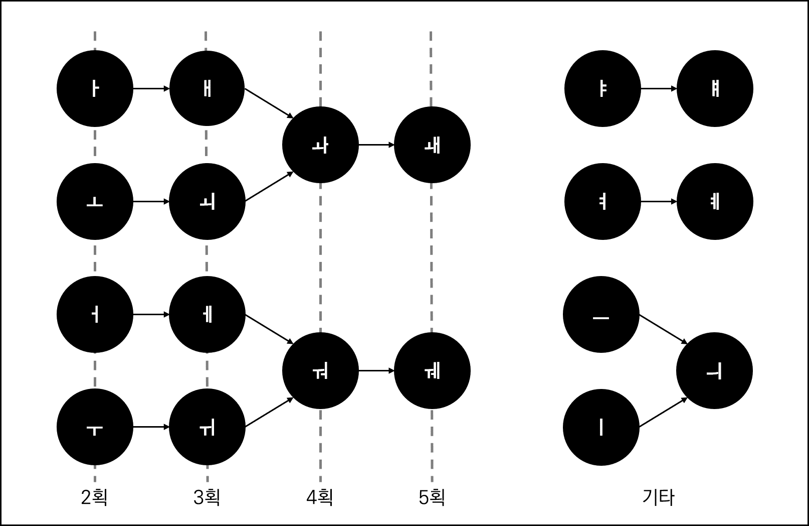

# HangulKeyboard

본 마크다운 문서에서는 한글 키보드(가제)의 기능과 사용법에 대해 설명합니다.

## 소개

한글 키보드(가제)는 한글 자판 시스템으로, [천지인 자판](https://namu.wiki/w/%EC%B2%9C%EC%A7%80%EC%9D%B8%20%EC%9E%90%ED%8C%90)과 [나랏글 자판](https://namu.wiki/w/KT%EB%82%98%EB%9E%8F%EA%B8%80%20%EC%9E%90%ED%8C%90)을 결합하고 기능을 추가하여 만들어졌습니다.
더불어 숫자, 특수문자 자판과 알파벳 입력을 위한 [쿼티 자판](https://ko.wikipedia.org/wiki/QWERTY_%EC%9E%90%ED%8C%90) 역시 탑재되어 있습니다. 

### 동기

첫 시작은 한글 창제의 원리를 더 오롯이 담고자 하는 마음이었습니다. 기존 두 자판의 자음과 모음 입력 방식을 결합하는 것이 일차 목표였습니다. 그 과정에서 새롭게 추가될 수 있는 기능을 발견하여 계획을 확장하였습니다.

## 기능

해당 서비스는 다음과 같은 기능을 지원합니다.
- 한글 및 숫자 입력 키보드
- 알파벳 및 숫자 입력 키보드
- 특수문자 및 숫자 입력 키보드

각 키보드는 짧게 누르기를 이용한 입력 방식만을 제공합니다. 길게 누르기, 슬라이드 등은 지원하지 않습니다.

## 사용법

한글 키보드(가제)의 한글 자판은 다음 표의 배치를 따릅니다.
(알파벳 자판과 특수문자 자판의 설명은 생략합니다.)

| | | | | |
|:-:|:-:|:-:|:-:|:-:|
|ㅣ|ㆍ|ㅡ|←|←|
|ㄱ|ㄴ|ㄹ|␣|␣|
|ㅁ|ㅅ|ㅇ|↑|+|

- ㅣ, ㆍ, ㅡ는 모음 조합에 이용됩니다. 예를 들어, 'ㅑ'는 ㅣ, ㆍ, ㆍ를 순서대로 누르면 만들어집니다.
- ㄱ, ㄴ, ㄹ, ㅁ, ㅅ, ㅇ은 자음입니다. ↑, +와 조합하여 다른 자음을 만들 수 있습니다.
- ↑는 '획추가'입니다. 자음 또는 모음에 획을 추가합니다. 예를 들어, 'ㅋ'은 ㄱ, ↑을, 'ㅑ'는 ㅣ, ㆍ, ↑을 순서대로 누르면 만들어집니다.
  (이를 이용하면 한 모음을 여러 방법으로 만들 수 있습니다.)
- +는 '모으기'입니다. 같은 자음을 모읍니다. 예를 들어, 'ㄲ'은 ㄱ, +를 순서대로 누르면 만들어집니다. (다른 기능을 후술합니다.)
- ←는 삭제입니다. 겹받침이 아닌 이상 무조건 자음 또는 모음 한 개를 통째로 지우며, 겹받침인 경우 자음 한 개만을 지웁니다.
- ␣는 공백입니다.

### '획추가'와 '모으기'의 활용

- ↑: 나랏글의 것을 확장합니다. 아래와 같습니다.
  - ㅏ ↔ ㅑ
  - ㅓ ↔ ㅕ
  - ㅗ ↔ ㅛ
  - ㅜ ↔ ㅠ
  - ㅐ ↔ ㅒ
  - ㅔ ↔ ㅖ

  ↑를 사용한 모음 입력은 클릭 횟수에 영향을 미치지 않습니다.

- \+: 아래와 같은 규칙으로 모음을 변형합니다.
  

### 예시

'뼈다귀'는 다음과 같은 방법으로 입력할 수 있습니다.

1. ㅁ (ㅁ)
1. ↑ (ㅂ)
1. \+ (ㅃ)
1. ㆍ (ㅃㆍ)
1. ㆍ (ㅃᆢ)
1. ㅣ (뼈)
1. ㄴ (뼌)
1. ↑ (뼏)
1. ㅣ (뼈디)
1. ㆍ (뼈다)
1. ㄱ (뼈닥)
1. ㅡ (뼈다그)
1. ㆍ (뼈다구)
1. ↑ (뼈다귀)

'수족관'은 다음과 같은 방법으로 입력할 수 있습니다.
1. ㅅ (ㅅ)
1. ㅡ (스)
1. ㆍ (수)
1. ㅅ (숫)
1. ↑ (숮)
1. ㆍ(숮ㆍ)
1. ㅡ (수조)
1. ㄱ (수족)
1. ㄱ (수족ㄱ)
1. ㆍ (수족ㄱㆍ)
1. ㅡ (수족고)
1. ㅣ (수족괴)
1. ㆍ (수족과)
1. ㄴ (수족관)
